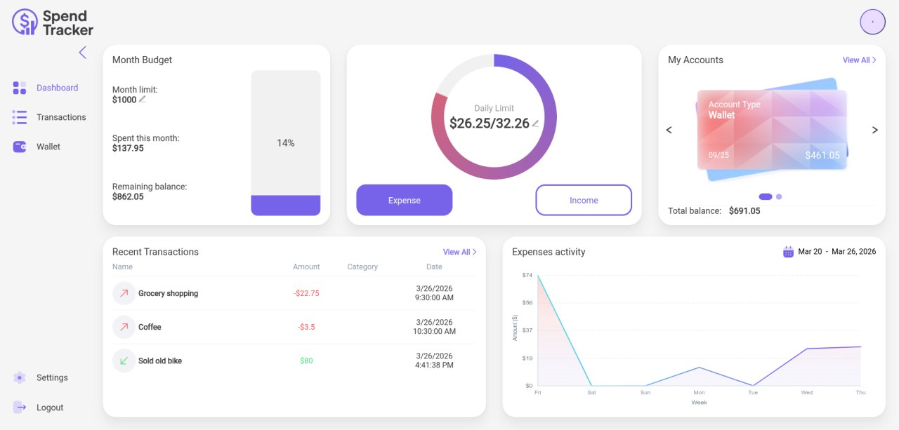
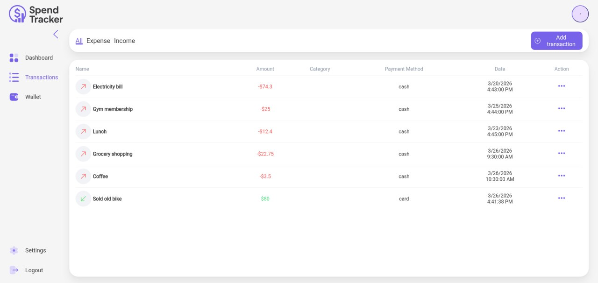
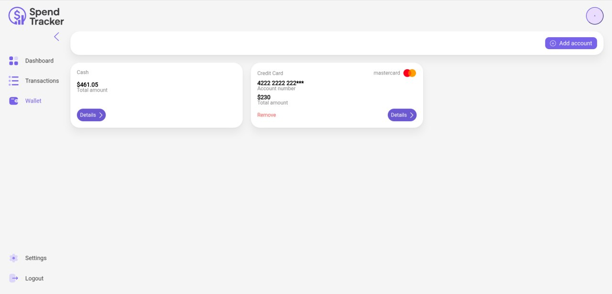
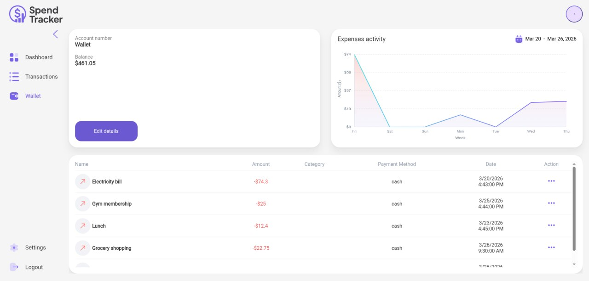

# Wallet

Wallet is a full-stack personal finance app for tracking balances, transactions, and spending limits. The repository contains a React client, an ASP.NET Core Web API, and PostgreSQL-backed persistence with Docker support for running the whole stack together.

## Features

- Expense tracking system with dynamic recalculation of daily spending limits based on the remaining balance
- Dashboard with widgets that clearly display recent activity
- Wallet and credit card account management
- Income and expense transaction tracking
- User profile management, including password updates and avatar uploads
- Email/password-based sign-up and sign-in
- JWT-based authentication with access tokens and refresh token cookie flow

## Screenshots

| Dashboard | Transactions |
| --- | --- |
|  |  |

| Wallet Accounts | Settings |
| --- | --- |
|  |  |

## Tech Stack

### Client

- React 19
- Vite 7
- Redux Toolkit
- React Router
- Sass

### Server

- ASP.NET Core Web API
- .NET 10
- Entity Framework Core
- ASP.NET Core Identity
- PostgreSQL
- JWT bearer authentication

## Repository Structure

```text
.
├── Client/          # React + Vite frontend
├── Server/          # ASP.NET Core solution
│   ├── WebAPI/      # HTTP API entrypoint
│   ├── BusinessLogic/
│   ├── DataAccess/
│   └── Common/
├── docker-compose.yml
└── .env.compose.example
```

## Main Application Areas

- `/dashboard` shows daily and monthly budget widgets, recent activity, and account summaries.
- `/transactions` manages income and expense records.
- `/wallet-accounts` manages the main wallet and linked credit cards.
- `/settings` includes profile editing, avatar upload, and password changes.

## API Surface

The backend currently exposes endpoints for:

- Authentication: `sign-up`, `sign-in`, `logout`, `refresh`, `me`, `change-password`
- Users: `GET /api/users`, `PATCH /api/users`
- Wallet: `GET/POST/PATCH /api/wallet`
- Credit cards: `GET/POST/PATCH/DELETE /api/credit-cards`
- Transactions: `GET/POST/PATCH/DELETE /api/transactions`
- Avatars: `POST/DELETE /api/uploads/avatars`

Swagger UI is available in development at `/swagger`.

## Run With Docker

This is the fastest way to start the full application.

1. Copy `.env.compose.example` to `.env`.
2. Fill in the required values:
   - `POSTGRES_PASSWORD`
   - `CORS_ALLOWED_ORIGIN`
   - `JWT_VALID_AUDIENCE`
   - `JWT_SIGNING_KEY`
3. Start the stack:

```bash
docker compose up --build
```

Default ports:

- Client: `http://localhost:3000`
- API: `http://localhost:8080`
- PostgreSQL: internal container port `5432`

### Docker Environment Notes

- `JWT_SIGNING_KEY` must be a Base64-encoded symmetric key because the API decodes it with `Convert.FromBase64String(...)`.
- Set `CORS_ALLOWED_ORIGIN` to the public client URL, for example `http://localhost:3000`.
- Set `JWT_VALID_AUDIENCE` to the same client origin used by the browser.
- In the provided Docker setup, the client container proxies `/api` requests to the API container, so `VITE_API_BASE_URL` can stay empty.
- For split-origin deployments outside the provided nginx proxy, set `VITE_API_BASE_URL` explicitly, for example `http://localhost:8080`.

## Run Locally Without Docker

### Prerequisites

- Node.js 20+
- npm
- .NET 10 SDK
- ASP.NET Core 10
- PostgreSQL 16+

### 1. Configure the API

Create `Server/WebAPI/appsettings.Development.json` from [Server/WebAPI/appsettings.Development.example.json](./Server/WebAPI/appsettings.Development.example.json) and replace the placeholder values.

Required settings:

- `ConnStr`
- `Cors:AllowedOrigins`
- `Authentication:Schemes:Bearer:ValidAudiences`
- `Authentication:Schemes:Bearer:ValidIssuer`
- `Authentication:Schemes:Bearer:SigningKeys[0].Value`

Optional:

- You can also place environment overrides in `Server/WebAPI/.env.local`. The API loads that file on startup if it exists.

### 2. Start the API

```bash
dotnet run --project Server/WebAPI/WebAPI.csproj
```

By default, the development profile runs on:

- `http://localhost:5231`
- `https://localhost:7072`

### 3. Configure the Client

Set the API base URL for Vite before starting the frontend.

Example using a local env file:

```bash
echo "VITE_API_BASE_URL=http://localhost:5231" > Client/.env.local
```

### 4. Start the Client

```bash
cd Client
npm install
npm run dev
```

The Vite dev server runs on `http://localhost:5500`.

## Authentication Flow

- The API returns a JWT access token on sign-in.
- The client stores the access token and sends it as a bearer token.
- A secure, HTTP-only refresh-token cookie is used to obtain new access tokens.
- On `401` responses, the client attempts a refresh and retries the original request.

## Useful Commands

```bash
# Frontend
cd Client
npm run dev
npm run build

# Backend
dotnet build Server/Wallet.sln
dotnet run --project Server/WebAPI/WebAPI.csproj
```
